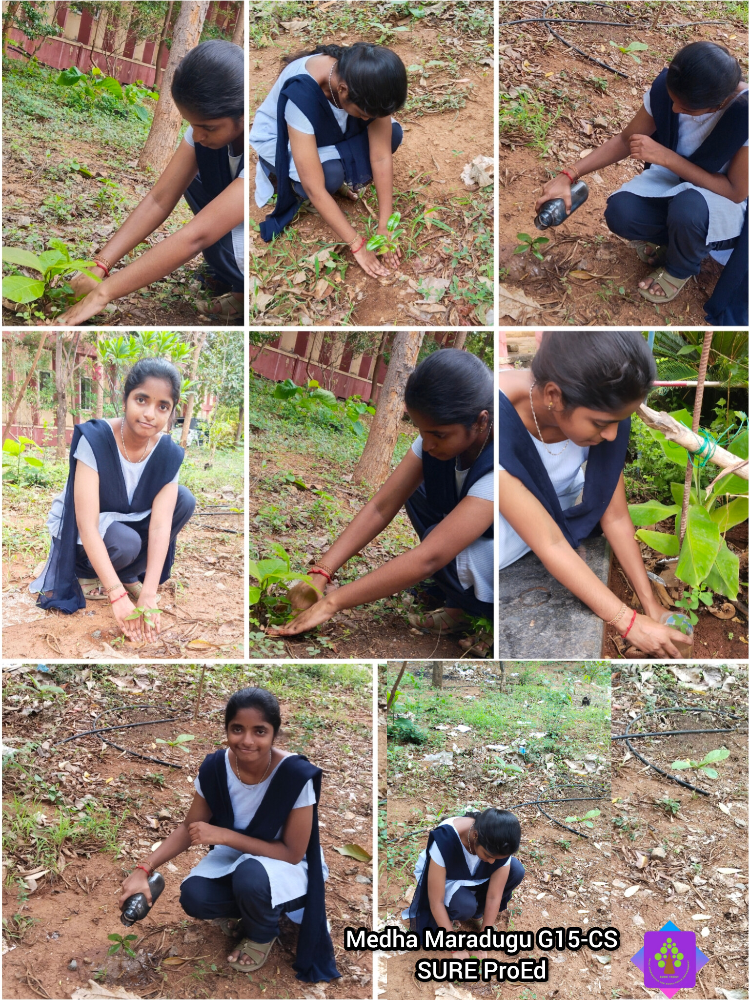
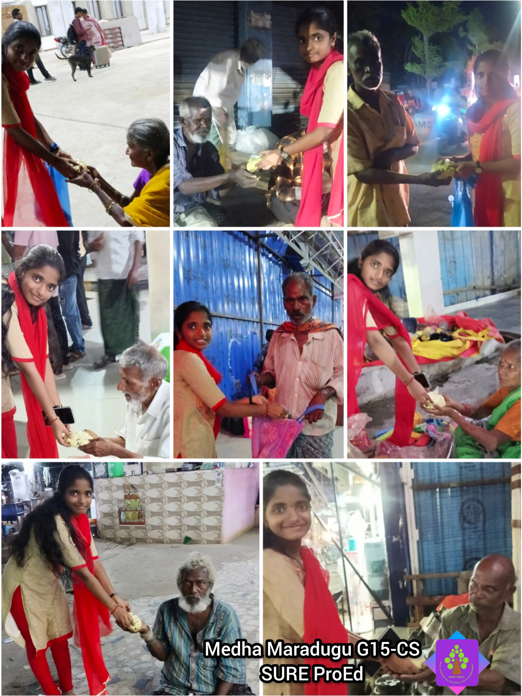

    

  <h1 align="center" style="font-family: Arial; font-weight: 600; margin-top: 15px;">SURE ProEd (formerly SURE Trust) 
      </h1>
<h2 style="color: #2b6cb0; font-family: Arial;">Skill Upgradation for Rural youth Empowerment Trust</h2>

<h2 style = "color:#333;"> Student Details </h2>

    
<strong>Name:</strong> Medha Maradugu 

    
<strong>Email ID:</strong> medhamardugug15cs@gmail.com 

    
<strong>College Name:</strong> Rajiv Gandhi University of Knowledge Technologies RKValley 

    
<strong>Branch/Specialization :</strong> Computer Science Engineering

    
<strong>College ID:</strong> R210723 

<h2 style="color:#333;"> Course Details </h2>

    
<strong>Course Opted:</strong> Cybersecurity & Ethical Hacking 

    
<strong>Instructor Name:</strong> Mr. Derick Mathew Johnson 

    
<strong>Duration:</strong> 6 Months

<h2 style="color:#333;"> Trainer Details </h2>

<strong>Trainer Name:</strong> Mr. Derick Mathew Johnson

<strong>Trainer Email ID:</strong> jderickmathew@gmail.com

<strong>Trainer Designation:</strong> Trainer at SureProEd

## **Table of Contents**
- [Course Learning](#course-learning-to-be-edited-by-student)
- [Projects Completed](#projects-completed)
- [Project Introduction](#project-introduction)
- [Technologies Used](#technologies-used)
- [Roles and Responsibilities](#roles-and-responsibilities)
- [Project Report](#project-report)
- [Learnings from LST & SST](#learnings-from-lst--sst)
- [Community Services](#community-services)
- [Certificate](#certificate)
- [Acknowledgments](#acknowledgments)

## Overall Learning 

During this course, I learned the fundamentals of Cybersecurity and Ethical Hacking.
I gained hands-on experience with Cybersecurity Tools and linux and strengthened my skills in 
Security,RedTeaming teamwork, documentation, and delivering real-world project solutions.

<h2 style="color:#333;"> Projects Completed </h2>

<strong><a href="#project1">Project 1:</a></strong> AI based Intrusion Detection System 

<!-- Project 1 -->
<h3 id="project1">Project 1: AI based Intrusion Detection System</h3>

  I developed an AI-Based Intrusion Detection System that detects malicious network traffic using machine learning. It includes a Flask dashboard for real-time monitoring and provides simple threat analysis to help identify cyber attacks.

  <a href="course_report.pdf" target="_blank"><strong>→ View Full Project Report</strong></a>

## **Learnings from LST and SST**

<!-- add your experiences over here -->
The Life Skills Training (LST) sessions helped me improve my self-confidence, time management, problem-solving, decision-making, and stress management skills. These sessions taught me how to stay positive, adapt to challenges, and maintain a professional attitude in both academic and personal life.

The Soft Skills Training (SST) sessions enhanced my communication, teamwork, presentation, and interpersonal skills. I also learned the importance of active listening, professional etiquette, and collaboration, which have prepared me to work effectively in internships and future professional environments.

## **Community Services**

<!-- add descreption in your own words -->

During my internship period, I actively participated in multiple community-oriented activities that promoted social responsibility, environmental awareness, and community welfare. These activities provided me with an opportunity to contribute to society while developing empathy, teamwork, and a sense of civic responsibility.<!-- add descreption in your own words -->

### **Activities Involved**
<!-- add the location where you given -->

  
 <!-- add the location where you have panted -->
- **Tree Plantation Drive** – Participated by planting trees and contributing to environmental improvement.

  <!-- add the location where you helped -->
- **Helping Elder Citizens** – Distributed food for the needy elder people

<!-- you can write impacts according to your experience in your words-->

### **Impact / Contribution**

- Helped create a supportive environment during the blood donation camp. <!-- add the location where you given -->
- Actively participated in promoting a greener and cleaner surroundings.
- Offered personal assistance to elder citizens, strengthening community bonds.
- Improved skills in communication, coordination, and social responsibility.

### **Photos**

<!-- add your photos below -->
<!-- change url below with your image urls (inside  src='')-->

---

## **Certificate**

The internship certificate serves as an official acknowledgment of the successful completion of my training period. It will be issued by the organization upon fulfilling all required tasks and meeting the performance expectations of the program. The certificate validates the skills, experience, and contributions made during the internship.

<!-- add your certificate image url below (inside src='')-->

---

## **Acknowledgments**

<!-- you can add Acknowledgments over here in same syntax as below . eg trainer name , company name , role etc -->

- [Prof. Radhakumari Challa](https://www.linkedin.com/in/prof-radhakumari-challa-a3850219b) , Executive Director and Founder - [SURE Trust](https://www.suretrustforruralyouth.com/)

